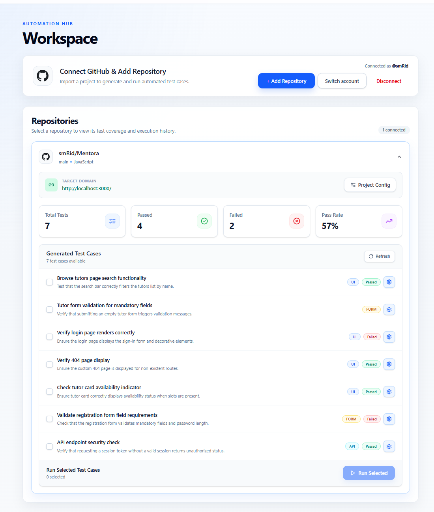
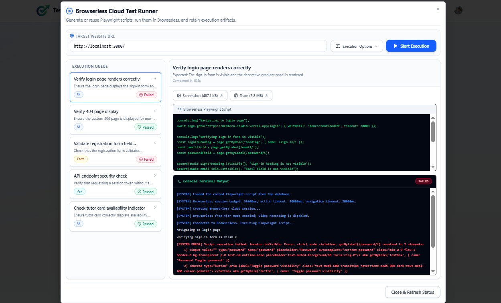

<div align="center">


# TestFlow Studio

### AI-Powered Testing Automation Workspace

TestFlow Studio connects to GitHub, analyzes application source code with Gemini,
generates structured test cases, converts them into Playwright scripts, and runs
them in Browserless Cloud. Results, logs, screenshots, traces, and execution
history are collected in one focused workspace.

[](https://testflow-studio.vercel.app)
[](https://nextjs.org/)
[](https://react.dev/)
[](https://tailwindcss.com/)
[](https://clerk.com/)
[](https://testflow-studio.vercel.app)

</div>

---

## Preview

<p align="center">
  
</p>

<p align="center">
  
</p>

> **Live site:** [https://testflow-studio.vercel.app](https://testflow-studio.vercel.app)

---

## Features

| Feature                          | Description                                                                                 |
| :------------------------------- | :------------------------------------------------------------------------------------------ |
| **Clerk Authentication**         | Secure sign-up, sign-in, session handling, protected workspace routes, and account controls |
| **GitHub OAuth Connection**      | Connect, switch, or disconnect a GitHub account using a state-validated OAuth flow          |
| **Encrypted Token Storage**      | GitHub access tokens are encrypted with AES-256-GCM before being stored                     |
| **Repository Import**            | Search and add accessible public or private repositories to the workspace                   |
| **AI Repository Analysis**       | Reads a focused set of source files and uses Gemini to generate 5-10 relevant test cases    |
| **Structured Test Cases**        | Stores title, description, type, priority, route, related files, and expected result        |
| **Editable Requirements**        | Update generated test details before producing or running automation scripts                |
| **Project Configuration**        | Save a target domain and global AI instructions for each connected repository               |
| **Playwright Script Generation** | Generates executable scripts from test metadata and repository source context               |
| **Cached or Regenerated Runs**   | Reuse a saved script or ask Gemini to regenerate it with optional runtime instructions      |
| **Browserless Cloud Execution**  | Runs selected tests in remote Chromium sessions through Playwright over CDP                 |
| **Live Execution Feedback**      | Displays queued, generating, running, passed, failed, and cancelled states                  |
| **Detailed Run Output**          | Shows generated scripts, console output, browser logs, errors, and execution duration       |
| **Execution Artifacts**          | Persists a final-page screenshot and Playwright trace for supported runs                    |
| **Quality Dashboard**            | Summarizes total tests, passed tests, failed tests, and repository pass rate                |
| **Stripe API Foundation**        | Includes checkout-session and webhook endpoints for future subscription workflows           |

---

## How It Works

1. A user signs in with Clerk and opens the protected workspace.
2. The user authorizes GitHub and imports a repository.
3. TestFlow reads selected application files from the repository through the GitHub API.
4. Gemini creates structured test cases based on real routes, components, APIs, and source files.
5. The user reviews or edits the generated cases and configures the target application URL.
6. Gemini converts each selected case into a validated Playwright script.
7. Playwright connects to Browserless Cloud and executes the script in remote Chromium.
8. TestFlow stores the result, logs, script, duration, screenshot, and trace in Neon Postgres.

---

## Tech Stack

<div align="center">

|     Technology      | Purpose                                                                           |
| :-----------------: | :-------------------------------------------------------------------------------- |
|   **Next.js 16**    | App Router, server routes, rendering, middleware, and deployment                  |
|    **React 19**     | Interactive landing page, repository workspace, dialogs, and execution UI         |
|   **TypeScript**    | Typed application logic, data models, and API contracts                           |
| **Tailwind CSS 4**  | Responsive styling and visual design system                                       |
|    **Radix UI**     | Accessible dialogs, accordions, checkboxes, and composable UI primitives          |
|      **Clerk**      | Hosted authentication, sessions, route protection, and user management            |
| **GitHub REST API** | OAuth identity, repository discovery, source tree access, and file retrieval      |
|  **Google Gemini**  | Repository-aware test case and Playwright script generation                       |
| **Playwright Core** | Browser automation, assertions, screenshots, tracing, and browser events          |
|   **Browserless**   | Managed remote Chromium execution over CDP                                        |
|  **Neon Postgres**  | Serverless persistence for users, repositories, connections, tests, and artifacts |
|   **Drizzle ORM**   | PostgreSQL schema definitions, queries, migrations, and development tooling       |
|     **Stripe**      | Subscription checkout and webhook integration foundation                          |
|  **Lucide React**   | Consistent interface icons                                                        |
|     **Vercel**      | Production hosting                                                                |

</div>

---

## Project Structure

```text
Testing-Automation/
|-- app/
|   |-- api/
|   |   |-- checkout/stripe/             # Stripe checkout session
|   |   |-- generate-test-cases/         # Gemini repository analysis
|   |   |-- github/                      # OAuth, callback, repos, connection state
|   |   |-- test-cases/                  # Test CRUD, execution, and artifacts
|   |   |-- user-repo/                   # Repository persistence and configuration
|   |   |-- users/                       # Clerk-to-database user synchronization
|   |   `-- webhooks/stripe/             # Stripe webhook receiver
|   |-- loading-workspace/               # Auth transition screen
|   |-- sign-in/                         # Clerk sign-in page
|   |-- sign-up/                         # Clerk sign-up page
|   |-- workspace/                       # Protected automation workspace
|   |-- globals.css
|   |-- layout.tsx
|   |-- page.jsx                         # Marketing landing page
|   `-- provider.tsx
|-- components/
|   |-- custom/                          # Workspace and automation components
|   `-- ui/                              # Reusable Radix-based UI components
|-- context/
|   `-- UserDetailContext.jsx
|-- db/
|   |-- index.ts                         # Neon and Drizzle client
|   `-- schema.ts                        # PostgreSQL schema
|-- drizzle/                             # SQL migrations
|-- lib/
|   |-- github-connection.ts             # Token encryption and connection helpers
|   |-- stripe.ts
|   `-- utils.ts
|-- public/
|   |-- logo.png
|   |-- preview1.png
|   `-- preview2.png
|-- scripts/
|   |-- migrate-browserless.mjs
|   |-- migrate-github-connections.mjs
|   `-- smoke-browserless-route.mjs
|-- .env.example
|-- drizzle.config.ts
|-- proxy.ts                              # Clerk route protection
`-- package.json
```

---

## API Overview

### GitHub Integration

| Endpoint               |  Method  | Purpose                                                               |
| :--------------------- | :------: | :-------------------------------------------------------------------- |
| `/api/github`          |  `GET`   | Start the GitHub OAuth authorization flow                             |
| `/api/github/callback` |  `GET`   | Validate OAuth state, exchange the code, and save the encrypted token |
| `/api/github/token`    |  `GET`   | Return the current GitHub connection status                           |
| `/api/github/token`    | `DELETE` | Remove the current GitHub connection                                  |
| `/api/github/repos`    |  `GET`   | Fetch repositories available to the connected GitHub account          |

### Repositories and Test Cases

| Endpoint                                |   Method   | Purpose                                                          |
| :-------------------------------------- | :--------: | :--------------------------------------------------------------- |
| `/api/user-repo`                        | `GET/POST` | List or save repositories for the current application user       |
| `/api/user-repo/settings`               |   `POST`   | Update a repository target domain and global test instructions   |
| `/api/generate-test-cases`              |   `POST`   | Analyze repository files with Gemini and persist generated cases |
| `/api/test-cases`                       |   `GET`    | Return test cases and execution metadata for a repository        |
| `/api/test-cases/settings`              |   `POST`   | Update an individual test case                                   |
| `/api/test-cases/run`                   |   `POST`   | Generate or reuse a script and execute it in Browserless         |
| `/api/test-cases/[id]/artifacts/[type]` |   `GET`    | Serve a stored `screenshot` or `trace` artifact                  |

### Billing Foundation

| Endpoint               | Method | Purpose                                       |
| :--------------------- | :----: | :-------------------------------------------- |
| `/api/checkout/stripe` | `POST` | Create a Stripe subscription checkout session |
| `/api/webhooks/stripe` | `POST` | Verify and receive Stripe webhook events      |

> Stripe routes are present, but the current workspace does not yet include a
> complete customer-facing pricing and subscription-management flow.

---

## Environment Variables

Copy the example configuration:

```bash
cp .env.example .env
```

On Windows PowerShell:

```powershell
Copy-Item .env.example .env
```

Configure the following values:

````env
# Application
NEXT_PUBLIC_APP_URL=http://localhost:3000

# Neon Postgres
DATABASE_URL=your_neon_postgres_connection_string

# Clerk
NEXT_PUBLIC_CLERK_PUBLISHABLE_KEY=your_clerk_publishable_key
CLERK_SECRET_KEY=your_clerk_secret_key
NEXT_PUBLIC_CLERK_SIGN_IN_URL=/sign-in
NEXT_PUBLIC_CLERK_SIGN_UP_URL=/sign-up

# GitHub OAuth
GITHUB_CLIENT_ID=your_github_client_id
GITHUB_CLIENT_SECRET=your_github_client_secret
GITHUB_REDIRECT_URI=http://localhost:3000/api/github/callback
GITHUB_TOKEN_ENCRYPTION_KEY=your_long_random_encryption_secret

# Google Gemini
GEMINI_API_KEY=your_gemini_api_key
GEMINI_MODEL=gemini-3.1-flash-lite

# Browserless Cloud
BROWSERLESS_API_KEY=your_browserless_token
BROWSERLESS_URL=wss://production-sfo.browserless.io
BROWSERLESS_TIMEOUT=55000
BROWSERLESS_ACTION_TIMEOUT=10000
BROWSERLESS_NAVIGATION_TIMEOUT=20000


### GitHub OAuth Setup

Create either a GitHub OAuth App or a GitHub App with user authorization.
The application needs read access to repository metadata and contents.

Use this callback URL locally:

```text
http://localhost:3000/api/github/callback
````

Use this callback URL in production:

```text
https://testflow-studio.vercel.app/api/github/callback
```

The configured callback URL must exactly match `GITHUB_REDIRECT_URI`.

---

## Getting Started

### 1. Clone the repository

```bash
git clone https://github.com/smRid/Testing-Automation.git
cd Testing-Automation
```

### 2. Install dependencies

```bash
npm install
```

### 3. Configure environment variables

Create `.env` from `.env.example` and add credentials for Neon, Clerk, GitHub,
Gemini, and Browserless. Stripe values are only required when using the billing
endpoints.

### 4. Prepare the database

Push the current Drizzle schema to the configured database:

```bash
npm run db:push
```

For an existing database that predates the GitHub connection or Browserless
execution fields, run the idempotent migrations:

```bash
npm run db:migrate:github
npm run db:migrate:browserless
```

### 5. Start development

```bash
npm run dev
```

Open [http://localhost:3000](http://localhost:3000).

---

## Available Scripts

| Command                          | Description                                        |
| :------------------------------- | :------------------------------------------------- |
| `npm run dev`                    | Start the Next.js development server               |
| `npm run build`                  | Create a production build                          |
| `npm start`                      | Start the production server                        |
| `npm run lint`                   | Run ESLint across the project                      |
| `npm run lint:fix`               | Apply supported ESLint fixes                       |
| `npm run db:generate`            | Generate Drizzle migration files                   |
| `npm run db:push`                | Push the Drizzle schema to Postgres                |
| `npm run db:migrate:github`      | Add and verify encrypted GitHub connection storage |
| `npm run db:migrate:browserless` | Add and verify Browserless execution fields        |
| `npm run db:studio`              | Open Drizzle Studio                                |
| `npm run test:browserless-smoke` | Run the disposable Browserless route smoke test    |

---

## Browserless Smoke Test

The smoke test expects the production app to be running on port `3001` and
requires valid database, GitHub, Gemini, and Browserless configuration.

```bash
npm run build
npm run start -- -p 3001
npm run test:browserless-smoke
```

The test verifies script execution, persisted status and logs, screenshot
delivery, and Playwright trace delivery.

> The runner currently caps Browserless sessions at 55 seconds for free-tier
> compatibility. Video recording is disabled; screenshots and traces are the
> supported artifacts.

---

## Deployment

The application is deployed on Vercel:

**Production URL:** [https://testflow-studio.vercel.app](https://testflow-studio.vercel.app)

For production deployment:

1. Add all required environment variables in the Vercel project settings.
2. Set `NEXT_PUBLIC_APP_URL` to `https://testflow-studio.vercel.app`.
3. Set `GITHUB_REDIRECT_URI` to `https://testflow-studio.vercel.app/api/github/callback`.
4. Add the production domain and redirect routes in the Clerk dashboard.
5. Add the exact production callback URL to the GitHub OAuth or GitHub App settings.
6. Use a dedicated `GITHUB_TOKEN_ENCRYPTION_KEY` that remains stable across deployments.
7. Ensure the Neon database schema and both compatibility migrations are applied.
8. Configure the Browserless region URL and API token.
9. Configure the Stripe webhook endpoint if the billing routes are enabled.

---

## Security Notes

- GitHub tokens are encrypted with AES-256-GCM before database storage.
- OAuth requests use a short-lived state cookie and a signed Clerk user binding.
- The workspace is protected by Clerk middleware.
- Generated scripts cannot import modules, read environment variables, or launch browsers.
- Script validation rejects unsupported runtime patterns before execution.
- Artifact responses use private, no-store caching.
- Secrets belong in `.env` locally and in encrypted deployment settings in production.

---

## License

This project is licensed under the [MIT License](./LICENSE).

---

<div align="center">

Built with Next.js, React, Clerk, GitHub, Gemini, Playwright, Browserless,
Neon Postgres, Drizzle ORM, Tailwind CSS, and Vercel.

</div>
